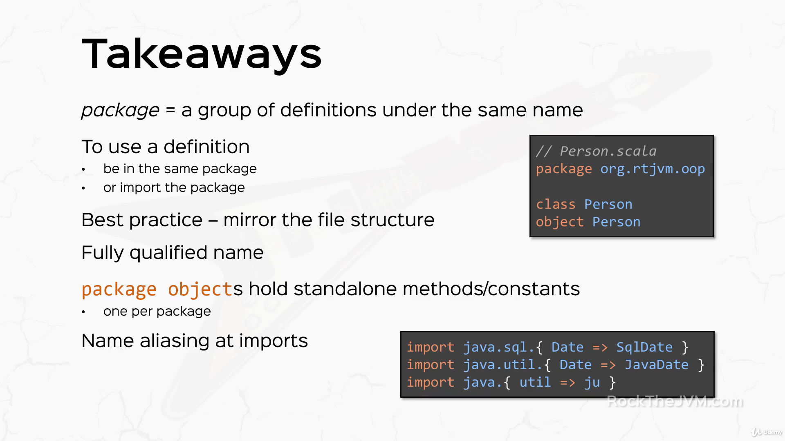

## Scala
### 1. ValuesVariablesTypes

- val - **immutable** (can't be reassigned)
```scala
  val x : Int = 2
  x = 4 //(not allowed)
```

- var - **mutable**
```scala
  var x : Int = 3
  x = 4 //(allowed)
```

```scala
  val aString: String = "hello"
  val anotherString = "goodbye"
  val aBoolean: Boolean = false
  val aChar: Char = 'a'
  val anInt: Int = x
  val aShort: Short = 4613
  val aLong: Long = 5273985273895237L
  val aFloat: Float = 2.0f
  val aDouble: Double = 3.14
  // variables
  var aVariable: Int = 4  
  aVariable = 5 // side effects
```


### 2. Expression

```Scala
  val x = 1 + 2 // EXPRESSION
println(x)

println(2 + 3 * 4)
// + - * / & | ^ << >> >>> (right shift with zero extension)

println(1 == x)
// == != > >= < <=

println(!(1 == x))
// ! && ||

var aVariable = 2
aVariable += 3 // also works with -= *= /= ..... side effects
println(aVariable)
```
- if expression
```Scala
// Instructions (DO) vs Expressions (VALUE)
// IF expression
val aCondition = true
val aConditionedValue = if(aCondition) 5 else 3 // IF EXPRESSION
println(aConditionedValue)
println(if(aCondition) 5 else 3)
println(1 + 3)

```


### 3. Call by value & Call by name

- => (Simple for call by name)


### 4. Default and Named arguments


### 5. Smart operations on Strings
- intepolators (s, f, raw)


### 6. Scala Oops basics


### 7. Method Notations 

- infix notation = operator notation (syntactic sugar)
- **operators** in scala are **methods** (ALL OPERATORS)
- prefix notation
  - unary_ prefix only works with - + ~ !
- postfix notation
- apply ()


### 8. Scala Object
- Scala doesn't have "static" instead it has "object"


### 8. Inheritance and Trait


### 9. Generics


### 10. Anonymous class


### 11. Case class


### 12. Exception


### 13. Packaging and imports


===================
## Functional Programming
### 14. What is a Function?


### 15. Anonymous Function / lambda


### 16. Higher-Order-Functions and Curries


### 17. Collections
- Overview

- Immutable Collections

- Mutable Collections

- Traversal

- Sequences

- List

- Array

- Vector


### 18. Tuples and Maps

